# Lab 2

# ACS730 Lab 2 

# Step 1 -  Reconnect to workstation

Security group in the earlier instance had been recreated with a new public ip addr (but same private ip as before) was allowing ssh ingress from the static ip used earlier to launch the instance. **manually** replaced the ip with new cidr/32 before notes on sg updates via aws cli. **However, aws-cli was used to create the subsequent security groups for the new instance**.

  
Details

  ### identity (re-login)
  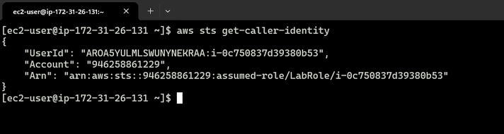

# Step 2 - Custom SSH key pair 
Local keypair created and imported into EC2

  
Details

  ### added key
  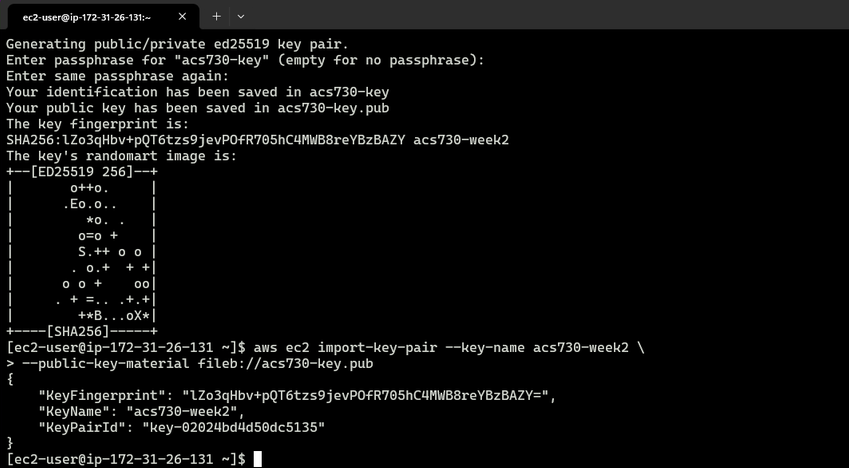
  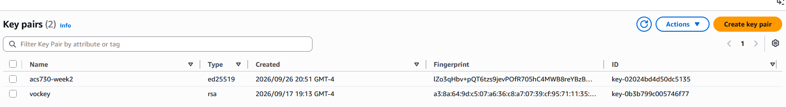

# Step 3 - Launch EC2
Created security group locally.
EC2 instance via cli failed - did not attach to SG; created manually.

  
Details

  ### Security group `my-sg` created
  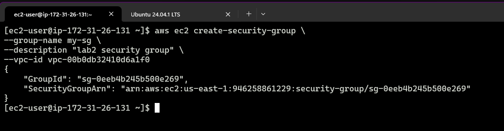
  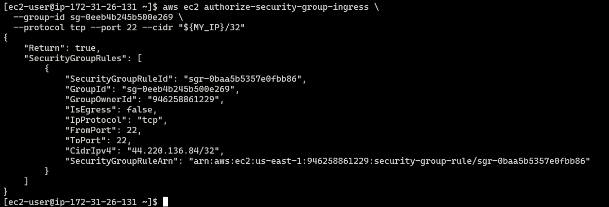
  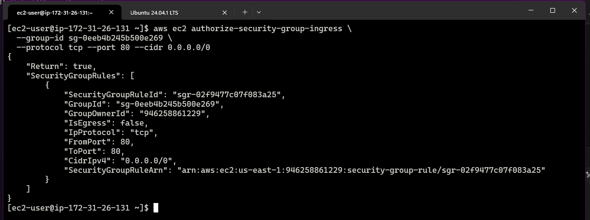
  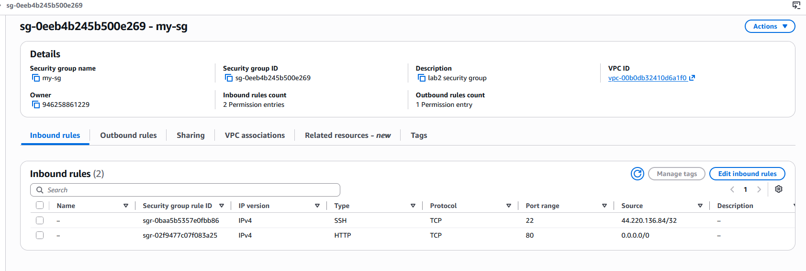

  ### Instance `lab2web2` attached
  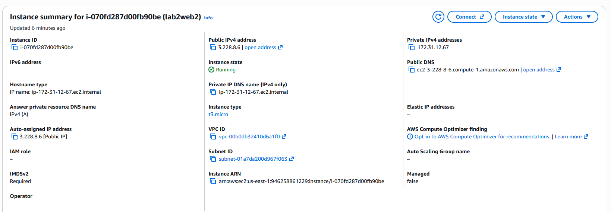
  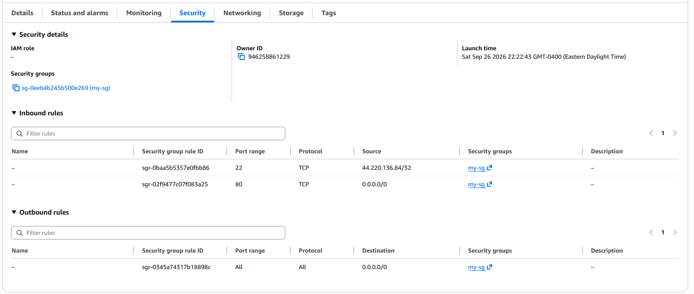

 

# Step 4 connect & create least privileged user
New acs730 user created.

  
Details

  ### user created
  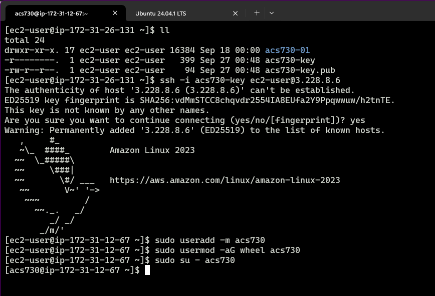

 

# Step 5 install packages with dnf 
Did not read ahead and _installed manually_. However, the `deploy-web.sh` script was created and used for running the server.
see: [script](scripts/deploy-web.sh).

# Step 6 Deploy the web application with a script 

  
Details

  The script was created directly on the newly launched web server.
  This is it being back-propagated for inclusion into the git repo
  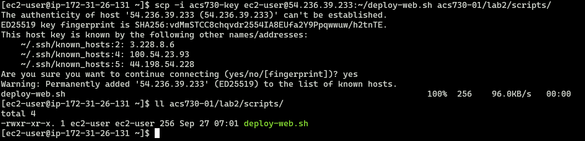

  **website up**:
  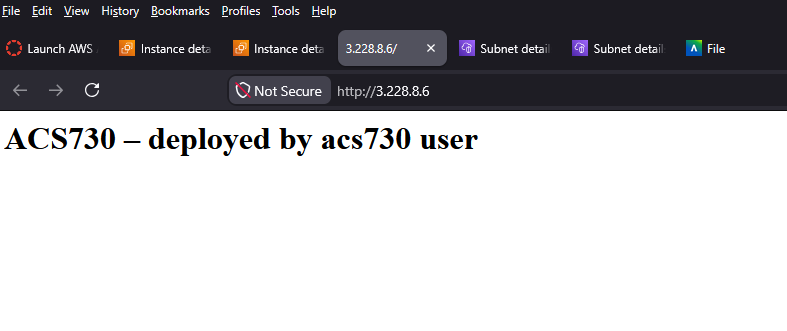

# Step 7 systemd service. 
Created systemd service wrapper to start service after network is ready, as a daemon process.

  
Details

  ### systemd service file
  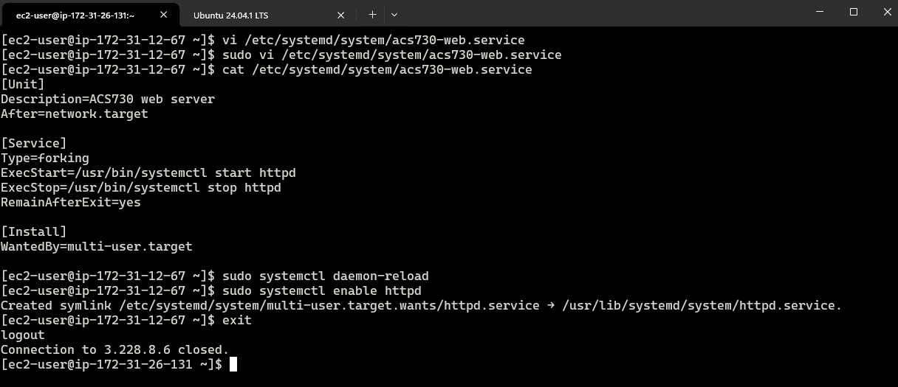

  :point_up: this is where a mistake was made: re-enabled httpd itself, instead of the new `acs730-web` service

 

# Step 8 reboot test
3 reboots were needed due to certain oversights, but the final reboot test passed.

  
Details

  ### stopped server
  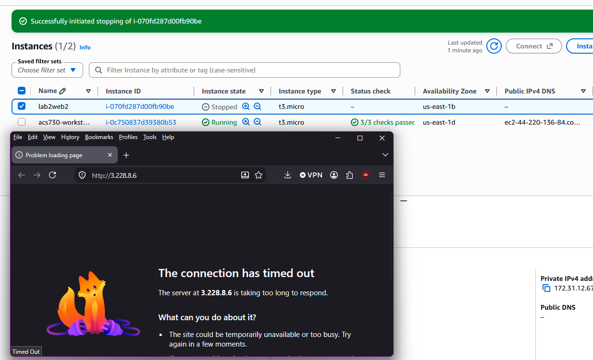

  ### confusions / missteps

  I thought the 1st restart had failed, but actually I was hitting the old IP address, forgetting that it would have changed.
  Secondly, I realized that the I had "enabled" httpd absent-mindedly, not acs730-web. So although the site was reachable after restart, it was reachable purely because i had enabled httpd.

  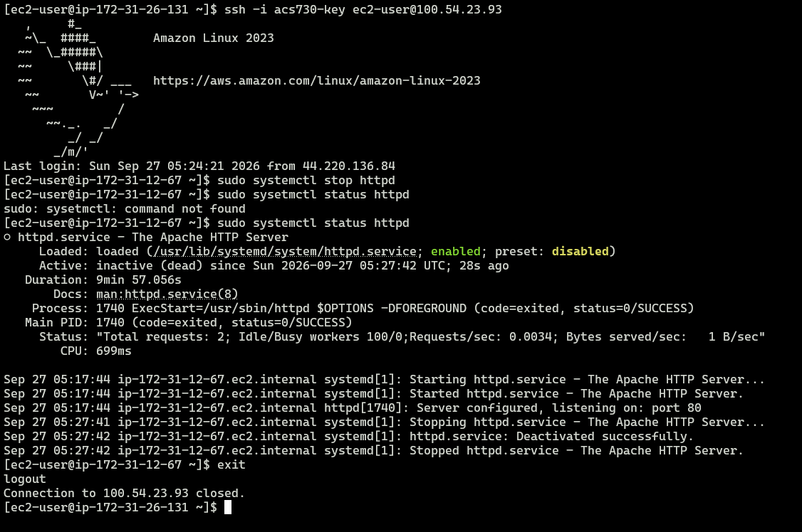

  In the end I had to disable httpd, and then enable acs730-web **without starting it right away**, and then reboot the server as a true test of the service file.

  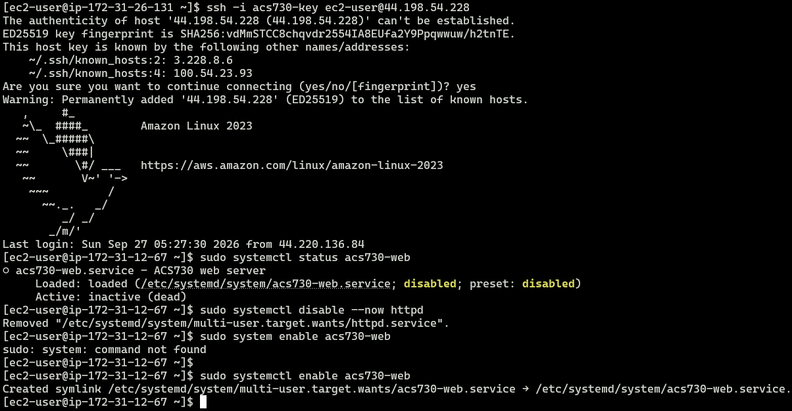

  ### final reboot OK
  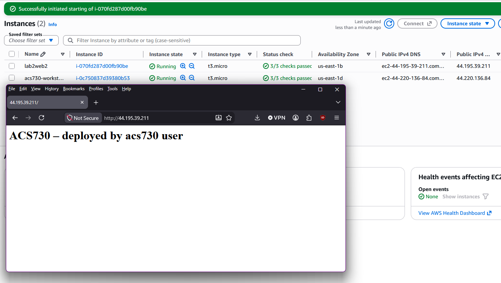

 

### Addendum: Rebooted (new ip addr) 
Forgot git / gh setup was on workstation and ended session prematurely. Hence, yet another new IP just prior to submit.
[alt text](evidence/ip-at-submission.png)
