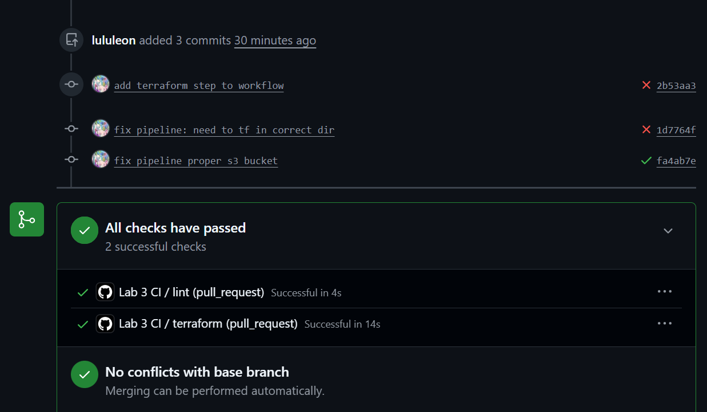
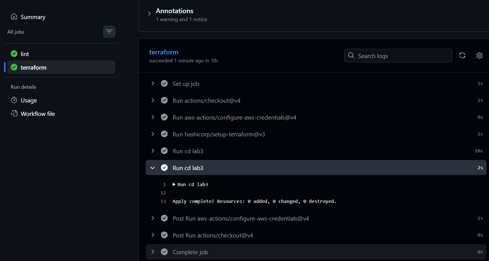

# Lab 3

A real AWS account would use OIDC instead of stored keys, because it is more secure:
- no need to store credentials in github secrets
- is part of Workflow Identity Federation which is the modern way workflows gain access to cloud resources without long-lived credentials.

We are using session-scoped secrets instead here as it is simpler to implement. Damage is limited by add the aws keys as github secrets: only those with correct access on the repo can see it, and the values are masked in workflow logs.

## Screenshots
Added directly to branch after pipeline passed:

Added after merge to main:

